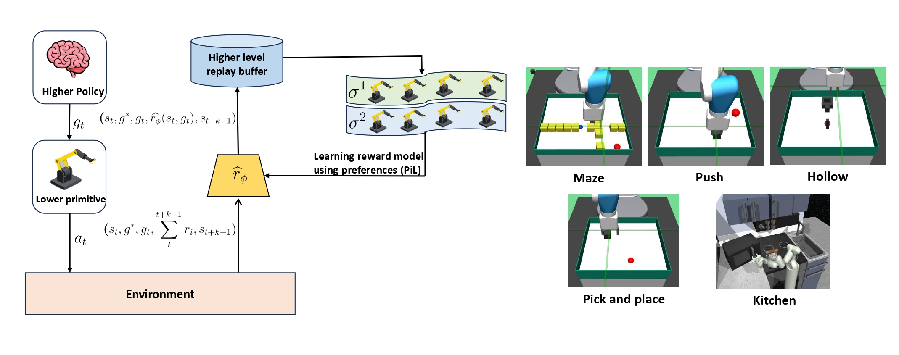
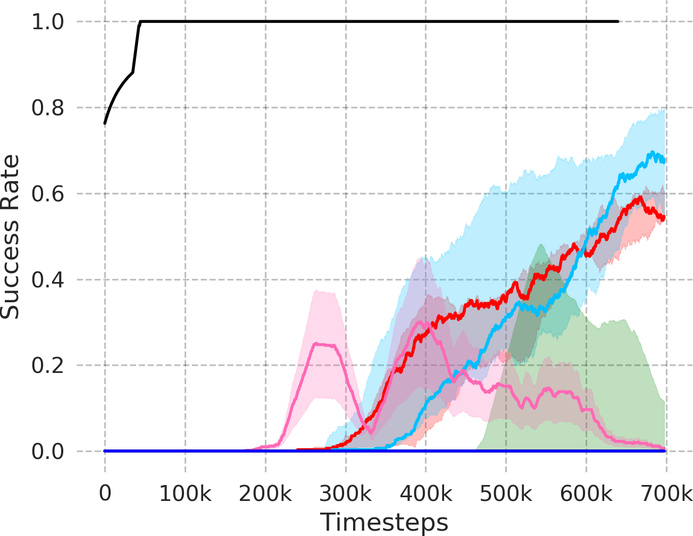
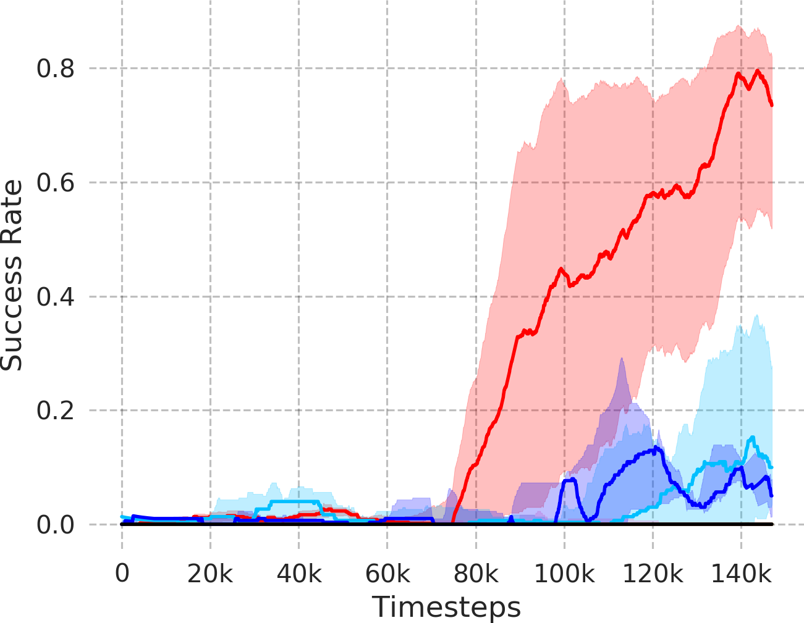
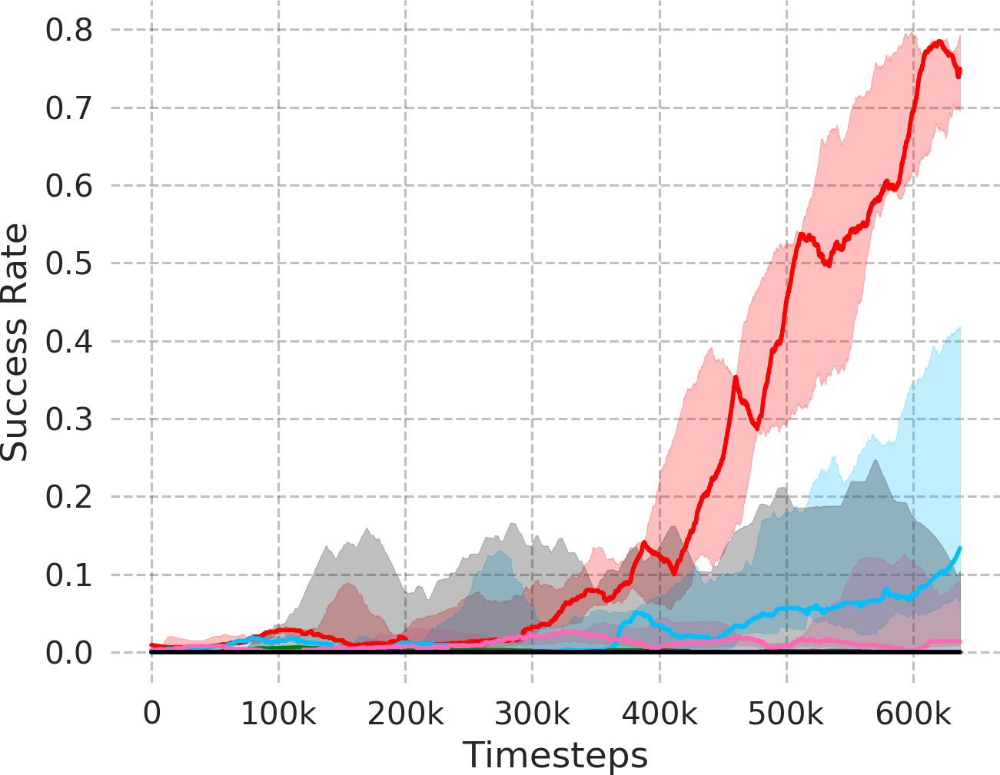
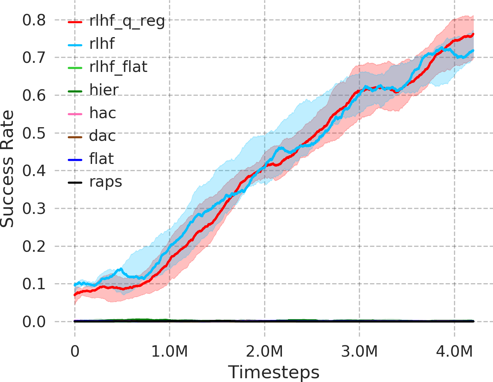
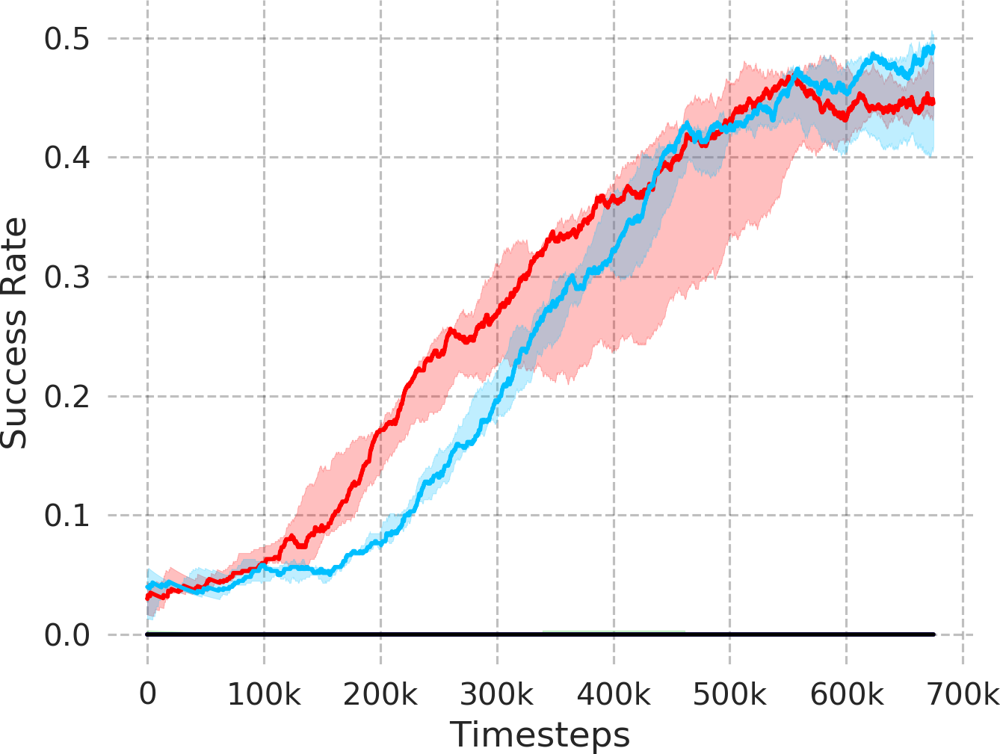

## Code for PIPER
### Code repository for PIPER

<p align="center">
  
</p>

This is a tensorflow based implementation for our approach PIPER: Primitive-Informed Preference-based Hierarchical Reinforcement Learning via Hindsight Relabeling, a novel approach that leverages preference-based learning to mitigate the issues of non-stationarity and infeasible subgoal generation in hierarchical reinforcement learning.

### 1) Installation and Usage
This code is based on [TensorFlow](https://www.tensorflow.org/). To install, run these commands:
  ```Shell
  # install the code
  git clone -b master --single-branch https://github.com/Utsavz/piper.git
  virtualenv piper
  source $PWD/piper/bin/activate
  pip install numpy
  pip install -r src/requirements.txt
  ```

### 2) Running demo
To run the demo, use the following scripts:
  ```Shell
  # For Maze navigation environment
  python experiment/play.py --dir=maze_piper_0 --render=1 --rollouts=10

  # For Pick and place environment
  python experiment/play.py --dir=pick_piper_0 --render=1 --rollouts=10

  # For Push environment
  python experiment/play.py --dir=push_piper_0 --render=1 --rollouts=10

  # For Franka kitchen environment
  python experiment/play.py --dir=kitchen_piper_0 --render=1 --rollouts=10

  ```

### 3) Training code
To train, use the following scripts. For baselines, change the parameters accordingly:
  ```Shell
  # For Maze navigation environment
  python experiment/train.py --env="FetchMazeReach-v1" --logdir="maze_piper_0" --n_epochs=3100 --reward_batch_size=50 --seed=0 --bc_loss=0 --num_hrl_layers=2 --reward_model=1 --q_reg=1

  # For Pick and place environment
  python experiment/train.py --env="FetchPickAndPlace-v1" --logdir="pick_piper_0" --n_epochs=3000 --reward_batch_size=50 --seed=0 --bc_loss=1 --num_hrl_layers=2 --reward_model=1 --q_reg=1

  # For push environment
  python experiment/train.py --env="FetchPush-v1" --logdir="push_piper_0" --n_epochs=13000 --reward_batch_size=50 --seed=0 --bc_loss=1 --num_hrl_layers=2 --reward_model=1 --q_reg=1

  # For Franka kitchen environment
  python experiment/train.py --env="kitchen-complete-v0" --logdir="kitchen_piper_0" --n_epochs=3000 --reward_batch_size=50 --seed=0 --bc_loss=1 --num_hrl_layers=2 --reward_model=1 --q_reg=1

  ```

### 4) Plot progress
To plot the success rate performances, use the following scripts:
  ```Shell
  # For Maze navigation environment
  python experiment/plot.py --dir1=maze_piper_0:piper --plot_name="maze"

  # For Pick and place environment
  python experiment/plot.py --dir1=pick_piper_0:piper --plot_name="pick"

  # For Push environment
  python experiment/plot.py --dir1=push_piper_0:piper --plot_name="push"

  # For Franka kitchen environment
  python experiment/plot.py --dir1=kitchen_piper_0:piper --plot_name="kitchen"
  
  ```

### 5). Results: Success rate performance
Here we provide the success rate performance results for various environments:

  <p align="center">
    
  </p>

  #### Maze navigation environment

  <p align="center">
    
  </p>

  #### Pick and place environment

  <p align="center">
    
  </p>

  #### Push environment

  <p align="center">
    
  </p>

  #### Hollow environment

  <p align="center">
    
  </p>

  #### Franka kitchen environment

  <p align="center">
    
  </p>